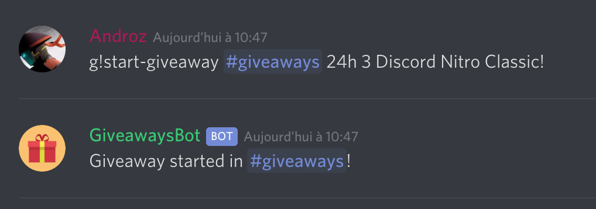

# Giveaways Bot

🎁Giveways Bot using the [discord-giveaways](https://npmjs.com/discord-giveaways) package!

## Features

* `start-giveaway` command
* `reroll-giveaway` command
* `end-giveaway` command

</img>
</img>

## Install

* Clone repository:
```sh
git clone https://github.com/Androz2091/giveaways-bot
```

* Fill configuration (config.json):
```json
{
    "token": "Your discord bot token",
    "prefix": "g!"
}
```

* Install dependencies:
```sh
npm install
```

* Start:
```sh
node index.js
```